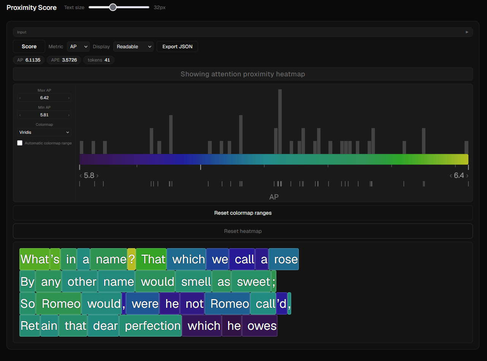

# Attention Proximity Score

A local web app for visualizing **Attention Proximity (AP)** — a per-token measure of how much a token's final-layer query–key representation reaches out to the rest of the text.

The app scores any text you paste, colors each token by its AP or APE value, and lets you click tokens to explore the underlying similarity matrix interactively.



---

## What it measures

**AP (Attention Proximity)** for token *i* is the mean of row *i* of the symmetrized QK dot-product matrix from the last attention layer of Qwen3-8B, with the diagonal excluded:

```
A_sym = (Q @ K.T / sqrt(d_k) + transposed) / 2     [last layer, all 32 heads averaged]
AP_i  = mean of row i, diagonal excluded
```

**APE (Attention Proximity Entropy)** is the Shannon entropy of the same row, measuring how evenly a token's attention is distributed across its context.

Neither metric uses softmax — these are raw logits, making them comparable across texts of different lengths.

---

## Requirements

| Requirement | Notes |
|-------------|-------|
| **CUDA GPU** | ~16 GB VRAM needed (Qwen3-8B in fp16). CPU inference is not supported. |
| **Python 3.10+** | Tested on 3.11 |
| **Node.js 18+** | For the React frontend |
| **HuggingFace account** | Free; must accept the Qwen3-8B license |

---

## Setup

### 1. Clone and install Python dependencies

```bash
git clone https://github.com/wilestk/attention-proximity-app.git
cd attention-proximity-app/proximity-score-app/backend
pip install -r requirements.txt
```

PyTorch with CUDA is required. If the plain `pip install torch` doesn't include CUDA, install from https://pytorch.org/get-started/locally/.

### 2. HuggingFace token

Qwen3-8B is a gated model — you need to accept its license before downloading.

1. Go to https://huggingface.co/Qwen/Qwen3-8B and click **Agree and access repository**
2. Create an access token at https://huggingface.co/settings/tokens
3. Set it as an environment variable before running:

```powershell
# Windows PowerShell
$env:HF_TOKEN = "hf_..."
```

```bash
# Linux / macOS
export HF_TOKEN="hf_..."
```

The model (~16 GB) downloads automatically on first run and is cached by HuggingFace for future runs.

### 3. Install frontend dependencies

```bash
cd proximity-score-app/frontend
npm install
```

---

## Running

From `proximity-score-app/`:

```bash
python run.py
```

This starts both the Flask backend (port 5000) and the Vite dev server (port 5173) together. Open http://localhost:5173 in your browser.

The first run downloads Qwen3-8B (~16 GB). Subsequent runs load from cache in about 30–60 seconds.

**Stop with Ctrl+C.**

---

## Usage

1. Paste any text into either panel and press **Score** (or Enter)
2. Each token is colored by its AP or APE value — brighter = higher proximity
3. **Click** a token to see its row of the similarity matrix as a heatmap
4. **Shift-click** to range-select, **double-click** to select a whole word, **Ctrl-click** to add to selection
5. **Reset heatmap** returns to the global AP/APE view
6. Switch between **AP** and **APE** metrics with the dropdown
7. The distribution chart below the controls shows the score histogram for the current view
8. **Export JSON** saves the full scored result (tokens, per-token AP/APE, and the full N×N matrix)

Use two panels side by side to compare texts directly — colormap range is shared across both panels.

---

## Project structure

```
proximity-score-app/
├── backend/
│   ├── app.py            — Flask server (POST /score, GET /health)
│   ├── scorer.py         — Model loading and AP/APE computation
│   └── requirements.txt
├── frontend/
│   ├── src/
│   │   ├── App.jsx           — Main app, panel layout, global state
│   │   ├── HeatText.jsx      — Token chip rendering and selection
│   │   ├── APDistribution.jsx — Score distribution histogram
│   │   ├── heatColor.js      — Color scheme functions
│   │   ├── StatusBar.jsx     — Status indicator
│   │   └── tokens.js         — Shared design tokens
│   ├── index.html
│   ├── package.json
│   └── vite.config.js
├── static-widget/
│   ├── ap-heatmap.js     — Self-contained vanilla JS widget (no React/build step)
│   ├── ap-heatmap.css
│   └── GITHUB_PAGES_INSTRUCTIONS.md
└── run.py                — Starts backend + frontend together
```

---

## License

MIT
